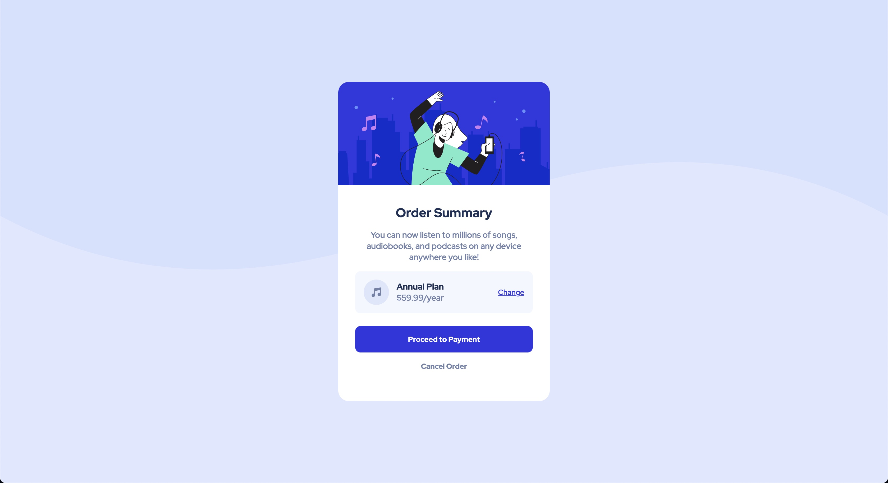
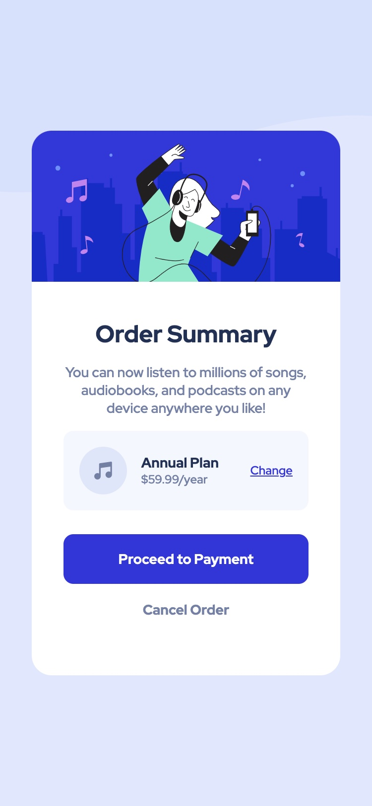

# Frontend Mentor - Order summary card solution

This is a solution to the [Order summary card challenge on Frontend Mentor](https://www.frontendmentor.io/challenges/order-summary-component-QlPmajDUj). Frontend Mentor challenges help you improve your coding skills by building realistic projects.

## Table of contents

- [Overview](#overview)
  - [The challenge](#the-challenge)
  - [Screenshot](#screenshot)
  - [Links](#links)
- [My process](#my-process)
  - [Built with](#built-with)
- [Author](#author)

## Overview

### The challenge

Users should be able to:

- See hover states for interactive elements

### Screenshot

#### Desktop :

#### Mobile :

### Links

- Solution URL: [Add solution URL here](https://github.com/akshayraichur/frontendmentor-challenges/tree/main/order-summary-component-main)
- Live Site URL: [Add live site URL here](https://akshayraichur.github.io/frontendmentor-challenges/order-summary-component-main/)

## My process

Got Started with building the basic structure with HTML and then styling it with CSS.

### Built with

- Semantic HTML5 markup
- CSS custom properties
- Flexbox
- Mobile-first workflow

## Author

- Website - [Add your name here](https://www.akshayraichur.com)
- Frontend Mentor - [@yourusername](https://www.frontendmentor.io/profile/akshayraichur)
- Twitter - [@yourusername](https://www.twitter.com/akshayvraichur)
